# 🏥 Clinical Risk Predictor
**A Praxis 2.0 Submission: GenAI + Machine Learning Innovation Showcase**

> **Theme**: Healthcare | Preventive Medicine | Human-AI Collaboration

---

## 🏆 Praxis 2.0 Overview
**Praxis 2.0** is a GenAI + Machine Learning innovation showcase where we design and build functional prototypes addressing real-world challenges. This project demonstrates:
1.  **Machine Learning**: For risk prediction and stratification.
2.  **Generative AI**: For reasoning, explanation, and patient-friendly insights.
3.  **Human-Centric Design**: Prioritizing clinical relevance and usability.

---

## 📋 Problem Statement (Track 1)

### Context
Chronic diseases such as diabetes often develop silently. By the time symptoms appear, interventions become costly and outcomes worsen. Clinicians operate under time pressure, limited historical data, and uncertainty—while patients struggle to understand probabilistic health risks.

### Problem
Design a clinical decision support workflow that helps surface early risk signals from routine patient data and supports informed, timely interventions—without overwhelming doctors or misleading patients.

### What the Solution Should Enable
- **Transform structured patient data into risk estimates with uncertainty**
- **Identify key contributing factors and modifiable drivers**
- **Communicate findings differently for clinicians and patients**
- **Suggest next-step actions (tests, lifestyle changes, follow-ups)**

---

## 📦 Expected Deliverables
We are targeting the following deliverables for the final showcase:

1.  **Public GitHub Repository**: Complete source code with architectural documentation.
2.  **Working Prototype**: Full-stack application (FastAPI + React) demonstrating the dashboard and patient portal.
3.  **Demo Video**: A walkthrough explaining the problem, solution, and key insights.
4.  **Documentation**:
    - [Model Card](./docs/MODEL_CARD.md): Details on ML models, metrics, and data.
    - [Ethics & Limitations](./docs/ETHICS_AND_LIMITATIONS.md): Bias considerations and safety guardrails.
    - [Architecture](./docs/ARCHITECTURE.md): Integration of ML + GenAI.

---

## 📊 Data, Modeling & Reasoning
**Dataset**: We are using the curated [diabetes_dataset.csv](./data/diabetes_dataset.csv) provided by the hackathon.

**Approach**:
*   **Machine Learning**: We apply techniques like XGBoost/Logistic Regression for *prediction* and *classification* of risk levels.
*   **Generative AI**: We utilize **Gemini/Open-source LLMs** to:
    *   Summarize complex clinical data into plain language.
    *   Generate "what-if" counterfactual scenarios (Reasoning).
    *   Draft personalized lifestyle action plans.

---

### Open Design Space
Teams may explore:
- Risk scoring, stratification, or cohort discovery
- Counterfactual reasoning (“what would reduce risk most?”)
- Longitudinal patient tracking
- Bias detection and safety considerations

### Evaluation Focus
- Clinical relevance of insights
- Clarity and trustworthiness of explanations
- Usability in real OPD / clinic workflows

## 🎯 Project Overview

Clinical Risk Predictor is a full-stack AI/ML application designed for real-world clinic workflows:

- **Clinician Dashboard**: High-density risk scores, key drivers, explanations, and actionable recommendations
- **Patient Portal**: Simple risk gauges, plain-language summaries, and personalized lifestyle guidance
- **Risk Model**: Explainable ML-based risk scoring with uncertainty quantification
- **Safety & Guardrails**: Bias detection, model transparency, and clinical validation checks

---

## 🏗️ System Architecture

### High-Level Architecture


### Data Flow

```mermaid
flowchart TB
    subgraph UserLayer["👤 User Interaction Layer"]
        Clinician[Clinician]
        Browser[Web Browser]
    end
    
    subgraph Frontend["⚛️ Frontend Application"]
        direction TB
        InputForm["📝 Patient Input Form<br/><small>Demographics + Vitals</small>"]
        Dashboard["📊 Clinician Dashboard<br/><small>Risk Visualization</small>"]
        SimUI["🎛️ What-If Simulator<br/><small>Interactive Sliders</small>"]
    end
    
    subgraph APIGateway["🔌 API Gateway Layer"]
        direction TB
        PredictAPI["/predict<br/><small>Risk Assessment</small>"]
        SimulateAPI["/simulate<br/><small>Counterfactuals</small>"]
        ReportAPI["/report<br/><small>AI Summary</small>"]
        HistoryAPI["/history<br/><small>Longitudinal Data</small>"]
    end
    
    subgraph Processing["🧠 Processing Layer"]
        direction TB
        
        subgraph MLPipeline["ML Pipeline"]
            Preprocess["Feature Engineering<br/><small>Scaling + Interactions</small>"]
            Ensemble["Stacking Ensemble<br/><small>XGB+LGBM+CatBoost</small>"]
            SHAP["SHAP Explainer<br/><small>Feature Attribution</small>"]
        end
        
        subgraph AIEngine["AI Engine"]
            PromptBuilder["Prompt Constructor<br/><small>Clinical Context</small>"]
            LLM["BioMistral-7B<br/><small>Medical LLM</small>"]
            PostProcess["Response Parser<br/><small>JSON Extraction</small>"]
        end
        
        subgraph Analytics["Analytics Engine"]
            VelocityCalc["Risk Velocity<br/><small>Δ Risk / Δ Time</small>"]
            CohortMatch["Digital Twin Finder<br/><small>K-NN Similarity</small>"]
        end
    end
    
    subgraph DataStore["💾 Data Persistence"]
        direction LR
        HistoryDB[("Patient History<br/>JSON Store")]
        PopDB[("Population DB<br/>100K Records")]
        Models[("Model Artifacts<br/>.joblib")]
    end
    
    %% Workflow 1: Risk Prediction
    Clinician -->|"1. Enter Vitals"| InputForm
    InputForm -->|"2. POST Patient Data"| PredictAPI
    PredictAPI -->|"3. Raw Features"| Preprocess
    Preprocess -->|"4. Engineered Features"| Ensemble
    Ensemble -->|"5. Risk Score (0-1)"| SHAP
    SHAP -->|"6. Score + Explanations"| PredictAPI
    PredictAPI -->|"7. Save Assessment"| HistoryDB
    PredictAPI -->|"8. Return Results"| Dashboard
    Dashboard -->|"9. Display Risk Gauge"| Clinician
    
    %% Workflow 2: What-If Simulation
    Clinician -->|"10. Adjust Sliders"| SimUI
    SimUI -->|"11. POST Modified Vitals"| SimulateAPI
    SimulateAPI -->|"12. Counterfactual Input"| Ensemble
    Ensemble -->|"13. New Risk Score"| SimulateAPI
    SimulateAPI -->|"14. Risk Reduction %"| SimUI
    
    %% Workflow 3: AI Report Generation
    Dashboard -->|"15. Request Report"| ReportAPI
    ReportAPI -->|"16. Fetch Patient Context"| HistoryDB
    HistoryDB -->|"17. Historical Data"| PromptBuilder
    PromptBuilder -->|"18. Clinical Prompt"| LLM
    LLM -->|"19. Natural Language Summary"| PostProcess
    PostProcess -->|"20. Structured Report"| ReportAPI
    ReportAPI -->|"21. Display Summary"| Dashboard
    
    %% Workflow 4: Longitudinal Analysis
    HistoryAPI -->|"22. Query History"| HistoryDB
    HistoryDB -->|"23. Time Series Data"| VelocityCalc
    VelocityCalc -->|"24. Trend Metrics"| Dashboard
    
    %% Workflow 5: Cohort Comparison
    PredictAPI -->|"25. Patient Profile"| CohortMatch
    CohortMatch -->|"26. Query Similar"| PopDB
    PopDB -->|"27. Digital Twins"| Dashboard
    
    %% Data Access
    Ensemble -.->|"Load Model"| Models
    
    classDef userStyle fill:#e3f2fd,stroke:#1976d2,stroke-width:2px
    classDef frontendStyle fill:#f3e5f5,stroke:#7b1fa2,stroke-width:2px
    classDef apiStyle fill:#fff3e0,stroke:#f57c00,stroke-width:2px
    classDef processStyle fill:#e8f5e9,stroke:#388e3c,stroke-width:2px
    classDef dataStyle fill:#fce4ec,stroke:#c2185b,stroke-width:2px
    
    class Clinician,Browser userStyle
    class InputForm,Dashboard,SimUI frontendStyle
    class PredictAPI,SimulateAPI,ReportAPI,HistoryAPI apiStyle
    class Preprocess,Ensemble,SHAP,PromptBuilder,LLM,PostProcess,VelocityCalc,CohortMatch processStyle
    class HistoryDB,PopDB,Models dataStyle
```


### Interaction Sequence


---

## 📁 Project Structure

```
clinical-risk-predictor/
├── backend/                    # FastAPI server
│   ├── app.py                  # Main FastAPI app
│   ├── models/                 # ML risk model & inference
│   │   ├── risk_model.py       # Risk scoring logic
│   │   ├── counterfactuals.py  # "What-if" analysis
│   │   └── explainability.py   # Feature importance, SHAP
│   ├── routes/                 # API endpoints
│   │   ├── patient.py          # Patient data endpoints
│   │   ├── risk.py             # Risk computation endpoints
│   │   └── cohort.py           # Cohort analysis endpoints
│   ├── schemas/                # Pydantic models
│   ├── requirements.txt        # Python dependencies
│   └── README.md               # Backend documentation
│
├── frontend/                   # React application
│   ├── public/
│   ├── src/
│   │   ├── components/
│   │   │   ├── Clinician/      # Clinician dashboard views
│   │   │   │   ├── RiskDashboard.tsx
│   │   │   │   ├── PatientList.tsx
│   │   │   │   ├── RiskDetail.tsx
│   │   │   │   └── CohortAnalysis.tsx
│   │   │   ├── Patient/        # Patient portal views
│   │   │   │   ├── RiskGauge.tsx
│   │   │   │   ├── SimpleReport.tsx
│   │   │   │   ├── ActionPlan.tsx
│   │   │   │   └── Progress.tsx
│   │   │   └── Common/         # Shared components
│   │   ├── pages/
│   │   ├── App.tsx
│   │   └── index.tsx
│   ├── package.json
│   └── README.md               # Frontend documentation
│
├── ml-research/                # ML model development
│   ├── notebooks/              # Jupyter notebooks for EDA & modeling
│   ├── data/                   # Training data
│   ├── train.py                # Model training script
│   ├── evaluate.py             # Model evaluation & metrics
│   └── README.md               # ML documentation
│
├── docs/                       # Project documentation
│   ├── ARCHITECTURE.md         # System design
│   ├── API_SPEC.md             # API documentation
│   ├── TEAM_ROLES.md           # Team responsibilities
│   ├── TIMELINE.md             # Development timeline
│   └── DEPLOYMENT.md           # Deployment guide
│
├── data/                       # Datasets
│   ├── diabetes_dataset.csv    # Training data
│   └── synthetic_patients.csv  # Test data
│
├── .github/
│   └── workflows/              # CI/CD pipelines (optional)
│
├── README.md                   # This file
├── .gitignore
└── CONTRIBUTING.md
```

---

## 👥 Team Roles (4 Members)

### 1. **ML Engineer** - Model Development & Explainability
- Dataset cleaning and EDA
- Risk model development (logistic regression, tree-based models)
- Uncertainty quantification
- Feature importance & SHAP explanations
- Counterfactual reasoning ("if BMI −2, risk ↓X%")
- Model evaluation and bias detection

**Deliverables:**
- `ml_research/train.py` - Model training pipeline
- `backend/models/risk_model.py` - Risk computation
- `backend/models/explainability.py` - Explainability logic

### 2. **Backend Engineer** - FastAPI Services
- API architecture & design
- Patient data ingestion endpoints
- Risk computation API
- Cohort analysis endpoints
- Authentication & logging
- Database schema (if using)
- Deployment setup (Render/Railway)

**Deliverables:**
- `backend/app.py` - FastAPI application
- `backend/routes/` - All endpoints
- `backend/requirements.txt` - Dependencies

### 3. **Frontend Engineer (Clinician View)**
- Clinician dashboard UI/UX
- Patient search & filtering
- Risk score visualization (cards, charts)
- Key driver display
- Explanation panels
- Action recommendation buttons

**Deliverables:**
- `frontend/src/components/Clinician/` - All clinician components
- Clinical workflow integration

### 4. **Frontend Engineer (Patient View) + UX/Docs**
- Patient portal UI/UX
- Simple risk gauge (traffic light)
- Plain-language explanations
- Lifestyle recommendation page
- Progress tracking
- Pitch deck & documentation

**Deliverables:**
- `frontend/src/components/Patient/` - All patient components
- `docs/` - Documentation
- Presentation slides

---

## 🚀 Tech Stack

| Layer | Technology |
|-------|------------|
| Backend | FastAPI, Python, scikit-learn / XGBoost |
| Frontend | React, TypeScript, Tailwind CSS / Material-UI |
| ML | pandas, scikit-learn, SHAP, matplotlib |
| Database | Optional (mock data initially) |
| Deployment | Render (backend), Vercel (frontend) |
| Version Control | GitHub |

---

## 📅 Development Timeline (Till Feb 10)

### Week 1: Design & Core Model (by Jan 24)
- [ ] Finalize disease scope & inputs
- [ ] Set up GitHub repo & boilerplate
- [ ] ML: Dataset exploration & preprocessing
- [ ] Backend: API skeleton & schema design
- [ ] Frontend: Wireframes & component structure

### Week 2: Full Stack Development (by Jan 31)
- [ ] ML: Working risk model with feature importance
- [ ] Backend: Risk API returning scores + drivers
- [ ] Frontend: Basic clinician & patient views working
- [ ] End-to-end integration test

### Week 3: Polish & Submission (by Feb 9)
- [ ] Add counterfactuals & cohort analysis
- [ ] Finish pitch deck
- [ ] Bug fixes & UI refinement
- [ ] Full demo rehearsal
- [ ] Submit code + presentation

---

## 🛠️ Getting Started

### Prerequisites
- Python 3.10+
- Node.js 18+
- Git

### Backend Setup
```bash
cd backend
python -m venv venv
source venv/bin/activate  # On Windows: venv\Scripts\activate
pip install -r requirements.txt
uvicorn backend.api:app --reload --port 8001
# Server runs on http://localhost:8001
```

### Frontend Setup
```bash
cd frontend
npm install
npm run dev
# App runs on http://localhost:5173
```

### ML Model Training
```bash
cd ml-research
python train_pro.py
# Outputs model to backend/models/
```

### 🐳 Docker Deployment (Recommended)
You can run the full stack with a single command:
```bash
docker-compose up --build
```
- **Frontend**: http://localhost:3000
- **Backend**: http://localhost:8001

---

## 📊 Key Features

### 1. Risk Scoring
- Patient risk stratification (low/medium/high)
- Confidence intervals for uncertainty
- Longitudinal risk tracking

### 2. Explainability
- Top contributing factors ranked
- SHAP force plots
- Feature importance charts

### 3. Counterfactuals
- "If you reduce BMI by 5%, your risk drops from 45% to 32%"
- Interactive "what-if" scenarios
- Modifiable vs. non-modifiable factors

### 4. Personalization & AI Reports
- Clinician view: Technical, detailed, filtereable
- AI Clinical Summaries: Natural language reports via local LLM
- Suggested actions based on risk tier

### 5. What-If Simulation
- Interactive sliders to modify patient vitals (e.g. Glucose, BMI)
- Real-time visualization of risk reduction logic
- Powered by counterfactual reasoning

### 6. Safety & Guardrails
- Bias detection by demographic groups
- Model uncertainty estimates
- Clinical validation checks
- Limitations & disclaimers

---

## 🎓 Evaluation Criteria (Praxis 2.0 Values)
We align our development with the core values of the showcase:

1.  **Thoughtful Problem Framing**: Addressing the core user needs of both clinicians (efficiency) and patients (understanding).
2.  **Sound Technical Reasoning**: Using appropriate ML metrics (AUC-ROC, calibration) and validating risk scores.
3.  **Responsible Use of AI**: Implementing bias checks, confidence intervals, and limitations documentation.
4.  **Clear Communication of Insights**: Translating complex model outputs into actionable, human-understandable guidance using GenAI.

---

## 📚 Documentation

See [docs/](./docs/) for:
- [ARCHITECTURE.md](./docs/ARCHITECTURE.md) - System design
- [API_SPEC.md](./docs/API_SPEC.md) - API details
- [TEAM_ROLES.md](./docs/TEAM_ROLES.md) - Detailed role breakdown
- [TIMELINE.md](./docs/TIMELINE.md) - Sprint planning

---

## 🤝 Contributing

See [CONTRIBUTING.md](./CONTRIBUTING.md) for:
- Git workflow
- PR requirements
- Code style guide
- Testing guidelines

---

## 📝 License

MIT License - See LICENSE file for details

---

**Built with ❤️ for Praxis Hackathon 2025**
